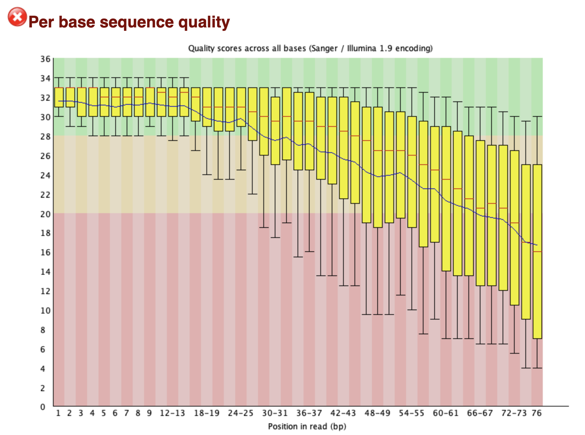
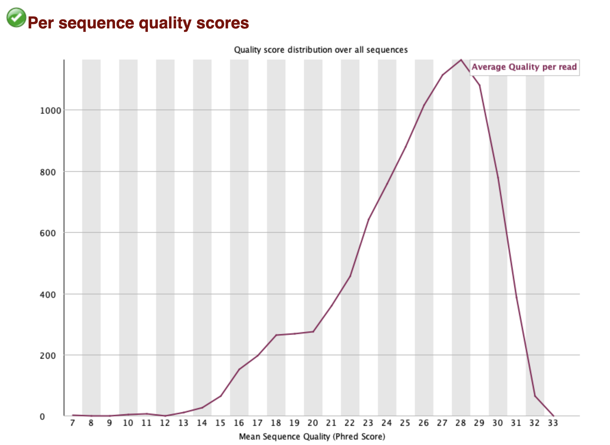
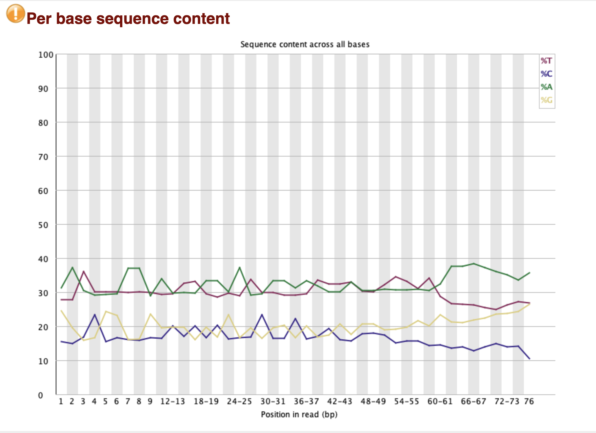
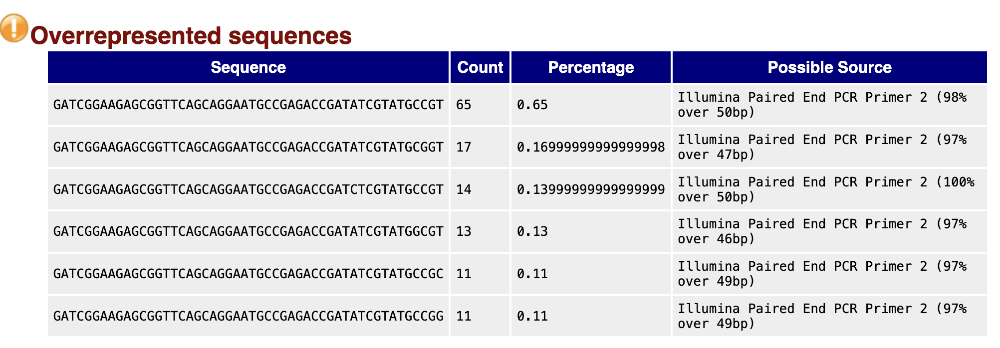
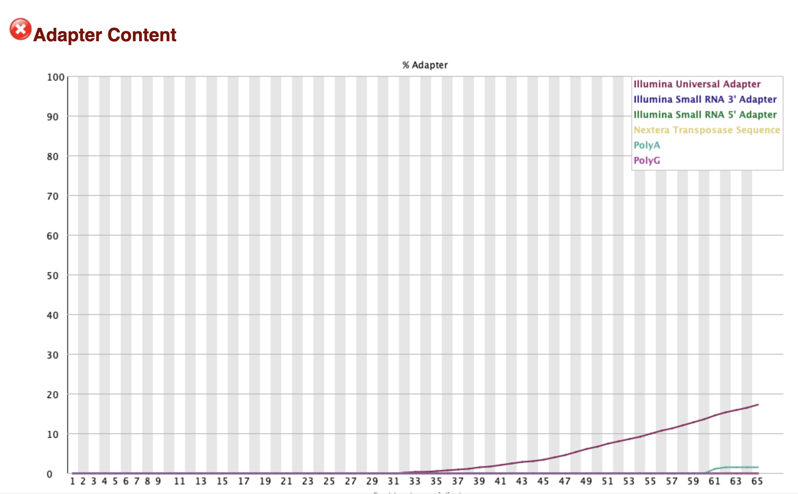
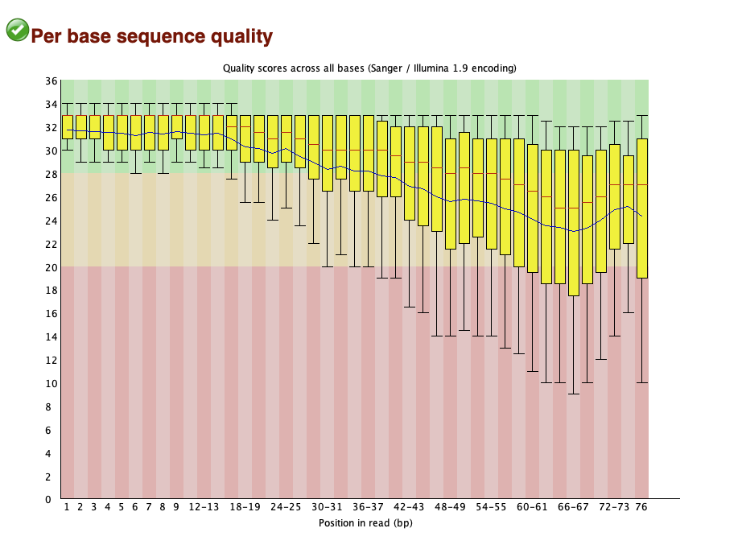
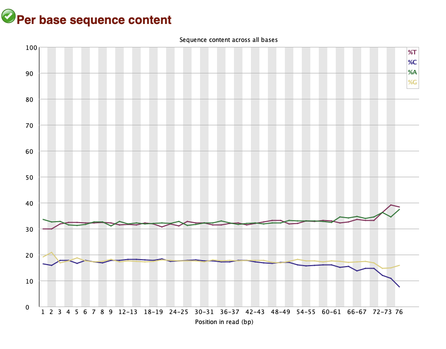
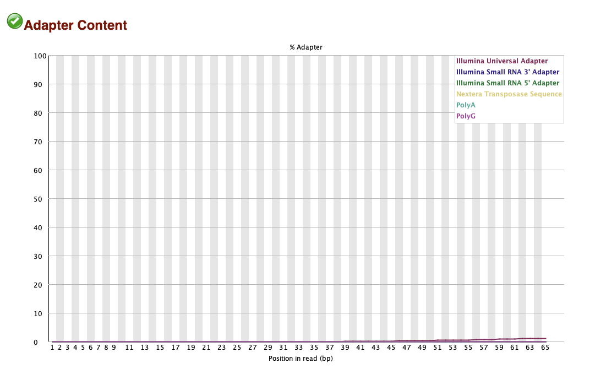

# Sequencing Data Quality Control for _Caenorhabditis elegans_ 

### 1. Data Information
In this assignment, I will be using the sequencing data from The Miilion Mutation Project - A *C. elegans* Mutation Resource. The original study can be found [here](https://www.ncbi.nlm.nih.gov/pmc/articles/PMC3787271/).

Brieftly, in this study, the authors generated sequencing data for 40 *C. elegans* mutants and their isogenic wild-type worms. The sequencing was done using Illumina HiSeq 2000.

### 2. Data preprocessing
In this assignment, I will be using the sequencing data  *SRR066627*.
First, I will download the data and use FastQC to inspect the quality of the raw sequencing data.

```
fastq-dump -X 10000 --split-files -O ./ SRR066627 

fastqc -q -o ./ SRR066627_1.fastq
```
A FASTQC report for the raw sequencing data is shown below:




The sequence starts with a high quality score but the quality scores decrease towards the end of the read, starting around base 50.


Overall, the average quality score per read is high, peaking at around 28. 


The nucleotide compositions is relatively even across all the bases, though there are some deviations especially towards the end of the read.


There is a significant number of overrepresented sequences in the data, most of which are around 50 bases long. These sequences are likely to be PCR primers.


There are some Illumina adapters in the sequencing data, which is not surprising given that the data is generated using the Illumina HiSeq 2000.

### 3. Data QC
In this section, I will perform quality control on the raw sequencing data using fastp to trim the low quality reads and remove the Illumina adapters.

```
# trim the low quality reads and remove the Illumina adapters
fastp --cut_tail \
    -i SRR066627_1.fastq -o SRR066627_1_trimmed.fastq \
    -I SRR066627_2.fastq -O SRR066627_2_trimmed.fastq 

# inspect the quality of the trimmed sequencing data
fastqc -q -o ./ SRR066627_1_trimmed.fastq
```

A FASTQC report for the trimmed sequencing data is shown below:



The quality of the trimmed sequencing data is improved compared to the raw sequencing data, especially towards the end of the read.




The nucleotide compositions in the trimmed sequencing data are more even across all the bases compared to the raw sequencing data that had more deviations, especially towards the end of the read.


After trimming, there are no overrepresented sequences in the data.



The Illumina adapters are removed effectively, with no significant adapter content remaining in the sequencing data.

Conclusion: The trimming process was effective in removing the low quality reads and the Illumina adapters, resulting in a higher quality sequencing data.