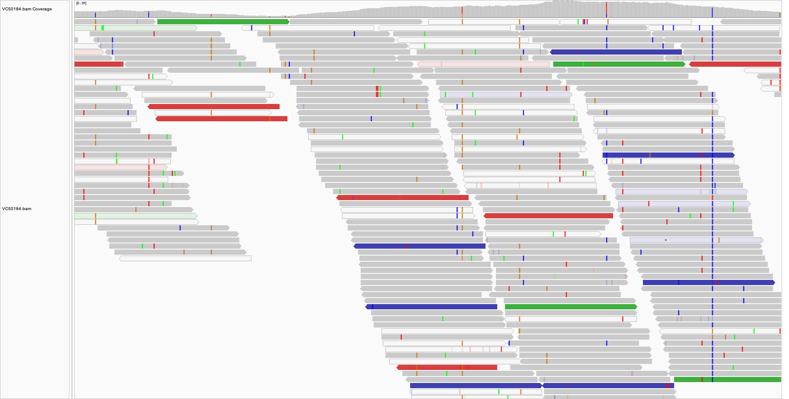
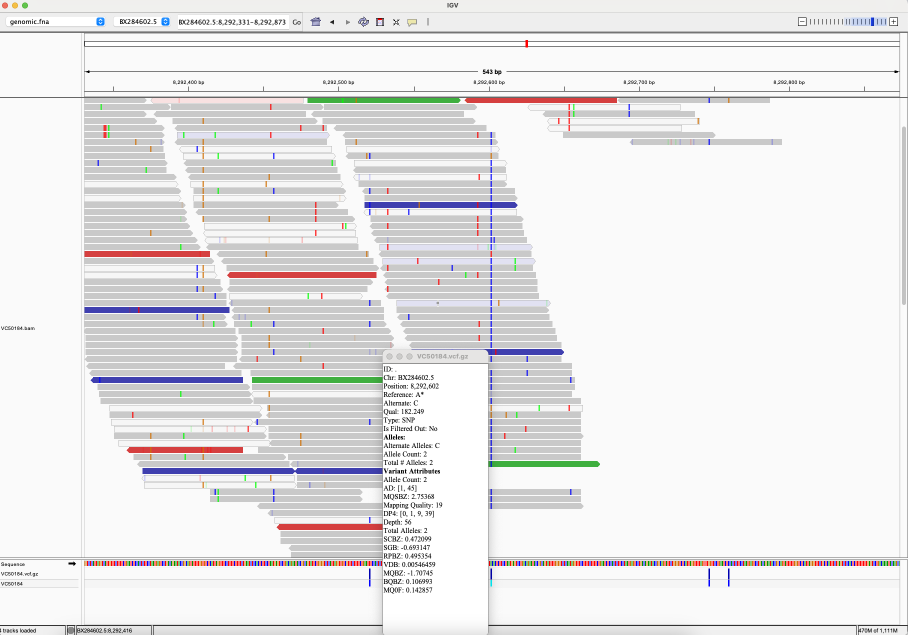
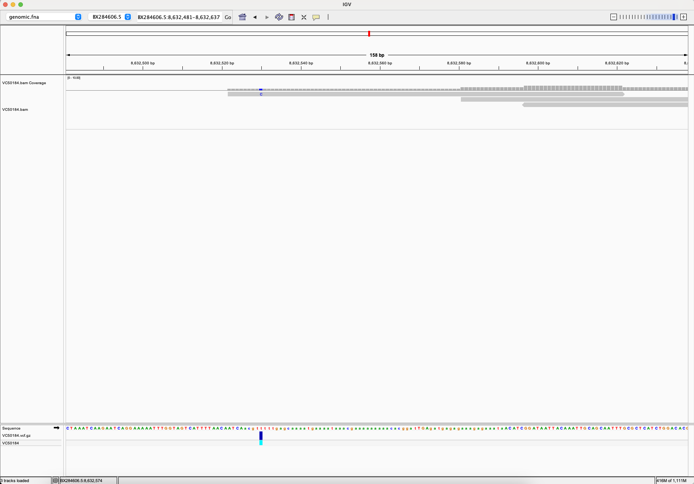

# Variant Calling Workflow Makefile

This Makefile automates the process of downloading, aligning, and calling variants for *C. elegans* genomic data.

## Overview of Variables

| Variable | Description |
|----------|-------------|
| `ACC`    | Accession number for the *C. elegans* genome |
| `REF`    | Path to the reference genome file |
| `GFF`    | Path to the GFF file containing annotations |
| `SRR`    | Sequencing read accession number |
| `N`      | Number of reads to download |
| `SAMPLE` | Sample name associated with the sequencing reads |
| `R1`     | Path to Read 1 FASTQ file |
| `R2`     | Path to Read 2 FASTQ file |
| `BAM`    | Output path for the BAM alignment file |
| `VCF`    | Output path for the compressed VCF file |

## Custom Makefile Settings

- `SHELL`: Uses `bash` for the Makefile.
- `.ONESHELL`: Forces each command line to run in a single shell.
- `.SHELLFLAGS`: Sets flags for shell behavior (`-eu -o pipefail`).
- `.DELETE_ON_ERROR`: Deletes output files if the command fails.
- `MAKEFLAGS`: Additional flags to control output and errors.

## Makefile Targets

### `usage`
Displays usage instructions for running the Makefile.

**command**:
```make
@echo "#"
@echo "# SNP call demonstration"
@echo "# ACC=${ACC}"
@echo "# SRR=${SRR}"
@echo "# SAMPLE=${SAMPLE}"
@echo "# BAM=${BAM}"
@echo "# VCF=${VCF}"
@echo "#"
@echo "# make bam|vcf|all"
@echo "#"
```

### `CHECK_FILE`
Ensures that the required `bio` toolbox is installed.

**command**:
```make
${CHECK_FILE}:
    @echo "# Please install toolbox with: bio code"
    @exit 1
```

### `bam`
Generates the BAM alignment file through multiple steps, such as downloading reference files, indexing, downloading sequence data, and aligning reads.

**command**:
```make
bam: ${CHECK_FILE}
    make -f src/run/genbank.mk ACC=${ACC} REF=${REF} GFF=${GFF} fasta gff
    make -f src/run/bwa.mk REF=${REF} index
    make -f src/run/sra.mk SRR=${SRR} R1=${R1} R2=${R2} N=${N} run
    make -f src/run/bwa.mk SM=${SAMPLE} REF=${REF} R1=${R1} R2=${R2} BAM=${BAM} run stats
```

### `vcf`
Calls SNPs on the BAM file to generate a compressed VCF file.

**command**:
```make
vcf:
    make -f src/run/bcftools.mk REF=${REF} BAM=${BAM} VCF=${VCF} run
```

### `all`
Runs all steps to generate both the BAM and VCF files.

**command**:
```make
all: bam vcf
```

### `.PHONY`
Marks certain targets as "phony," indicating they do not correspond to actual files.

**Declaration**:
```make
.PHONY: bam vcf all usage
```

## Variant calling

This BAM file view displayed in IGV. 
- Red: Indicates a mismatch in one direction (usually A or T).
- Green: Indicates a mismatch in the opposite direction (often G or C).
- Blue: Typically marks insertions relative to the reference.
- Orange: Often marks deletions relative to the reference.

The blue line all the way to the end indicates the position of the insertion at around 8,292,602bp, which is supported by the majority of reads mapped to this region.


This variant is further supported by the VCF file, where the variant is called at this position with a confidence score of 100.


In this example, the variant is called by only one read, which is a very low confidence score, indicating that this variant is likely not real.

