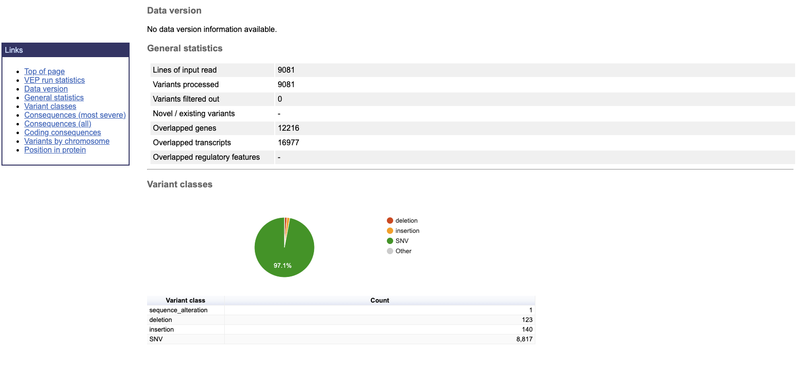
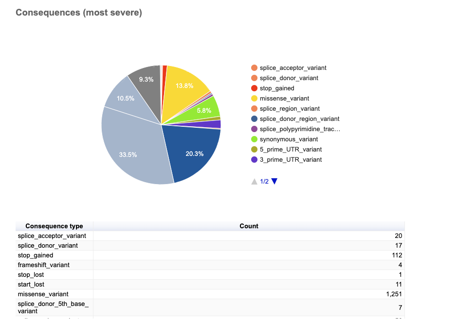
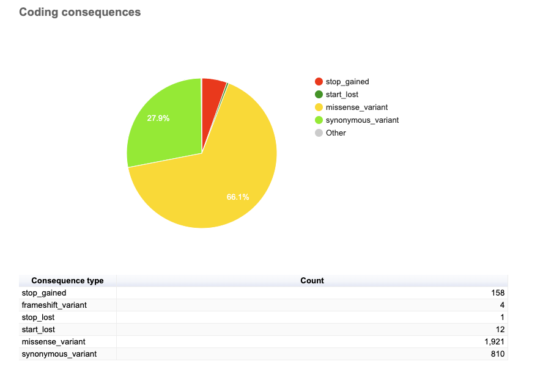

# Variant effect prediction

## 1. Install VEP

First, set up a new environment and install the required packages:
```bash
# Create a new conda environment for VEP
micromamba create -y -n vep perl perl-dbi perl-lwp-simple perl-dbd-mysql perl-bio-db-hts

# Activate the environment
micromamba activate vep

# Make a directory for sources
mkdir -p ~/src

# Change to the source directory
cd ~/src

# Clone the VEP repository
git clone https://github.com/Ensembl/ensembl-vep

# Change to the VEP directory
cd ensembl-vep

# Install the VEP package
perl INSTALL.pl --NO_HTSLIB --NO_TEST

# Verify the installation
./vep --help
```

## 2. Run VEP

```bash
make vep
```
Results:
### Variant Classes
The types of variants identified in the dataset are as follows:

- SNVs (Single Nucleotide Variants): 8,817 (dominant class, ~97% of variants)
- Insertions: 140 (~1.5%)
- Deletions: 123 (~1.4%)
- Sequence Alterations: 1 (<0.1%)










### Chromosomal Distribution of Variants
The variants are distributed across the following chromosomes:

- Chromosome BX284606.5: 1,699 variants
- Chromosome BX284603.4: 1,202 variants
- Chromosome BX284602.5: 1,445 variants
- Chromosome BX284604.4: 1,572 variants
- Chromosome BX284605.5: 1,926 variants
- Chromosome BX284601.5: 1,237 variants

### Summary of Variants
-  SNVs Dominate: Single nucleotide variants make up the overwhelming majority of the dataset, consistent with expectations in genomic studies.
- High Regulatory Impact: The prevalence of missense variants and stop-gained mutations highlights potential impacts on protein function.
- Intron and Intergenic Variants: Variants in non-coding regions dominate (~30% combined), suggesting regulatory impacts or less direct functional changes.
- Chromosome Variability: Variants are distributed across all chromosomes, with BX284605.5 having the most (1,926) and BX284603.4 the least (1,202).
