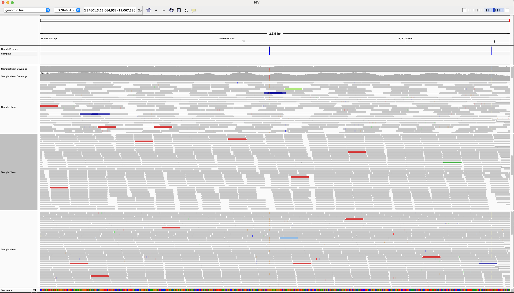

# Variant Calling Pipeline

This pipeline automates the process of variant calling using SRA samples. It includes downloading reference genomes, aligning reads, calling variants, and merging VCF files.

## Prerequisites
Ensure the following tools are installed:
- `wget`
- `bwa`
- `samtools`
- `bcftools`
- `fastq-dump`

## Files
- `Makefile`: The workflow definition.
- `design.csv`: A file containing a list of SRA accession numbers (one per line).

## Running the Pipeline
1. **Prepare the SRA List**:
   Populate `design.csv` with SRA accession numbers.

2. Run the Makefile with GNU Parallel
 ``` cat design.csv | parallel --dry-run --lb -j 4 --colsep , --header : make run SRR={Run} SAMPLE={Sample} ```

3. Merge the vcf files into one:
```
# Merge VCF files into a single one.
bcftools merge -0 vcf/*.vcf.gz -O z > merged.vcf.gz

# Index the merged VCF file
bcftools index merged.vcf.gz
```
4. Visualize the merged VCF file using IGV:
