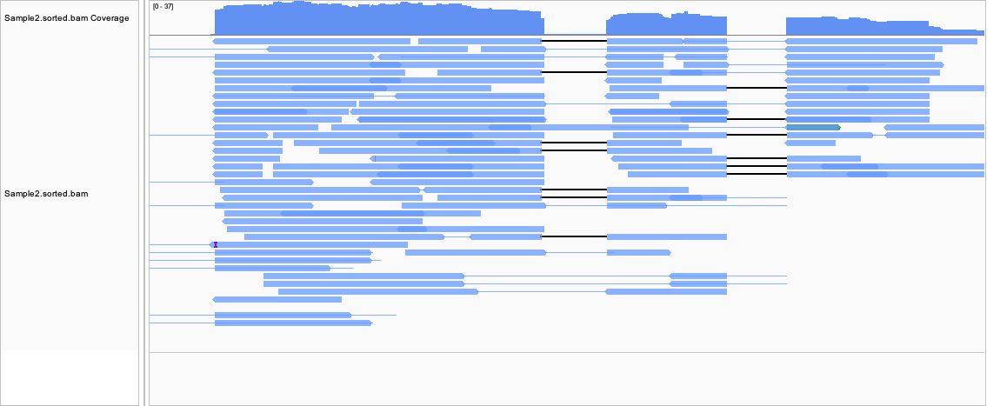

# Variant Calling Pipeline

This pipeline automates the process of variant calling using SRA samples. It includes downloading reference genomes, aligning reads, calling variants, and merging VCF files.

## Prerequisites
Ensure the following tools are installed:
- `wget`
- `bwa`
- `samtools`
- `bcftools`
- `fastq-dump`

## Files
- `Makefile`: The workflow definition.
- `design.csv`: A file containing a list of SRA accession numbers (one per line).

## Running the Pipeline
1. **Prepare the SRA List**:
   Populate `design.csv` with SRA accession numbers.

2. Run the Makefile with GNU Parallel
```
cat design.csv | parallel --lb -j 4 --colsep , --header : make run SRR={Run} SAMPLE={Sample}
```

# Index the merged VCF file
```
bcftools index merged.vcf.gz
```

4. Visualize the merged VCF file using IGV:


5. Count the number of reads mapped to each gene
First few lines of count matrix from sample 2 and sample 3:
```
Geneid                     Chr       Start   End      Strand   Length   Sample2   Sample3
gene-CELE_Y74C9A.6         BX284601.5 3747    3909    -        163      2         0
gene-CELE_Y74C9A.3         BX284601.5 4116    10230   -        6115     118       91
gene-CELE_Y74C9A.2         BX284601.5 11495   16837   +        5343     244       199
gene-CELE_Y74C9A.4         BX284601.5 17484   21139   -        5787     227       186
gene-CELE_Y74C9A.5         BX284601.5 27591   32548   -        4958     24        32
```

## Observations:
### Consistent Expression Levels:

- `gene-CELE_Y74C9A.3`: Shows similar expression in Sample2 (118) and Sample3 (91). The variance is small compared to the magnitude, indicating potential consistent expression under these conditions.
- `gene-CELE_Y74C9A.4`: Another example with counts 227 and 186, showing a similar trend.

### Variable Expression Levels:

- `gene-CELE_Y74C9A.6`: Expressed minimally in Sample2 (2) and not detected in Sample3 (0). This suggests low or condition-specific expression.
-  `gene-CELE_Y74C9A.2`: Expression counts (244 and 199) show greater consistency, but still some variability between samples.
