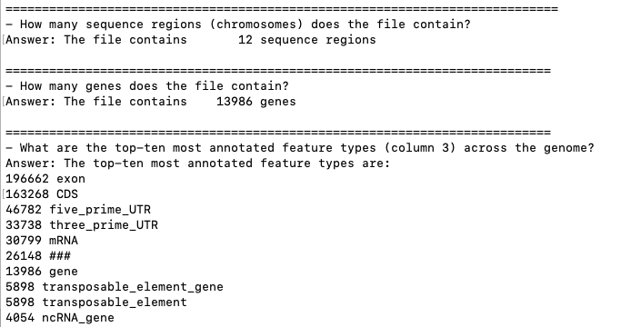

# Scripting in Bash

This script is used to download annotation files and inspect some features of the downloaded file.

Follow the steps below to run the script:

1. Download the script file `hw4_script.sh` from my repository.
   
```
conda activate bioinfo

git clone https://github.com/hanhntran/bmmb852_24/tree/main/hw4/scripts
```

2. Make the script file executable by running this command:
```
cd ./scripts/
chmod +x hw4_script.sh
```

3. Run the script by typing this command in the terminal:
```
bash ./hw4_script.sh
```

4. To modify the script to inspect different genomes, open it with a text editor such as `nano`.
```
nano hw4_script.sh
```

5. Change the line that specifies the input file name to the name of the file containing the organism that you want to inspect. 
```
# the URL to the annotation file (gff3) and the file name
ANNOTATION_URL="your_url_here/your_file_name_here.gff3"

GFF3_FILE="your_file_name_here.gff3"

# file name for the gene annotation
GENE_FILE="your_file_name_here.gene.gff3"
```

6. Save and exit the text editor.


7. Run the script again by typing `./hw4_script.sh` in the terminal.
```
bash ./hw4_script.sh
```

Example output:




