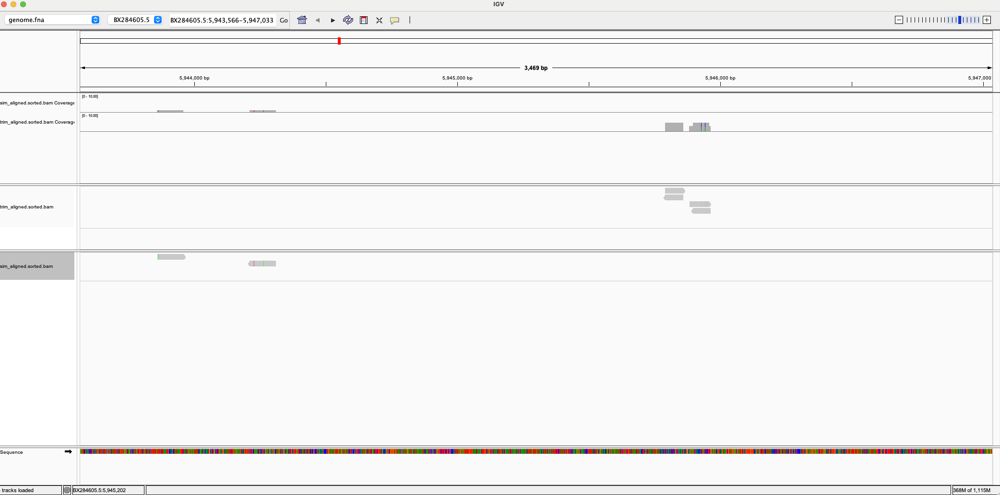

# Overview
This `Makefile` is used to download the genome and simulate the reads, then run FastQC and Fastp to trim the reads on an automated fashion. 

### Prerequisites
Package: bioinfo

### Makefile variables:
- `ACC`: Genome accession number, currently set to GCA_000002985.3.
- `GFF`: Path to the downloaded genomic GFF file.
- `GENOME`: Symlink to the genome FASTA file (genome.fna).
- `N`: Number of reads to simulate or download.
- `R1_sim` and `R2_sim`: Paths to the simulated read files.
- `L`: Length of the reads to simulate.
- `SRA`: SRA accession number for downloading reads, currently set to SRR066627.
- `R1` and `R2`: Paths to the downloaded reads.
- `T1` and `T2`: Paths to the trimmed reads.

### Makefile commands:
- `info`: Print summary information on the genome.
- `download`: Download the genome file and unzip.
- `clean`: Remove the downloaded files.
- `simulate`: Simulate the reads.
- `fastqc`: Run FastQC on the reads.
- `trim`: Run Fastp to trim the reads.
- `align`: Align the reads to the genome.
- `clean_align`: Clean up the aligned files.
- `all`: Run all the steps.

### How to run the Makefile
#### 1. View help
```
make help
```

#### 2. Download the genome and simulate the reads
```
make download
make simulate
```
#### 3. View information on the genome
```
make info
```

#### 4. Simulate the reads
```
make simulate
```

#### 5. Download SRA reads
```
make download
```

#### 6. Run FASTQC to check the quality of the reads
```
make fastqc
```
#### 7. Run Fastp to trim the reads and check the quality of the trimmed reads
Note: the trim command will also run FastQC on the trimmed reads. 
```
make trim
```
#### 8. Index the genome
```
make index
```
#### 9. Align the reads to the genome
```
make align
``` 
#### 10. Generate alignment summary
```
make summary
```
Output files:
- `trim_aligned.flagstat`: Summary of the trimmed reads alignment.
```
17794 + 0 in total (QC-passed reads + QC-failed reads)
17786 + 0 primary
0 + 0 secondary
8 + 0 supplementary
0 + 0 duplicates
0 + 0 primary duplicates
17207 + 0 mapped (96.70% : N/A)
17199 + 0 primary mapped (96.70% : N/A)
17786 + 0 paired in sequencing
8893 + 0 read1
8893 + 0 read2
16914 + 0 properly paired (95.10% : N/A)
16974 + 0 with itself and mate mapped
225 + 0 singletons (1.27% : N/A)
34 + 0 with mate mapped to a different chr
23 + 0 with mate mapped to a different chr (mapQ>=5)

```
- `sim_aligned.flagstat`: Summary of the simulated reads alignment.
```
20002 + 0 in total (QC-passed reads + QC-failed reads)
20002 + 0 primary
0 + 0 secondary
0 + 0 supplementary
0 + 0 duplicates
0 + 0 primary duplicates
20002 + 0 mapped (100.00% : N/A)
20002 + 0 primary mapped (100.00% : N/A)
20002 + 0 paired in sequencing
10001 + 0 read1
10001 + 0 read2
20002 + 0 properly paired (100.00% : N/A)
20002 + 0 with itself and mate mapped
0 + 0 singletons (0.00% : N/A)
0 + 0 with mate mapped to a different chr
0 + 0 with mate mapped to a different chr (mapQ>=5)
```

### Visualize the alignment



The alignment is visualized using IGV. It seems that both the simulated and downloaded reads do not have much coverage on the genome. There are only a few regions that have one or two reads aligned. This is likely due to the fact that 1) the simulated reads are short (100bp) and do not have much coverage with 10,000 reads simulated, 2) the downloaded reads are from SRA and might be of low quality and thus not aligned to the genome well. 