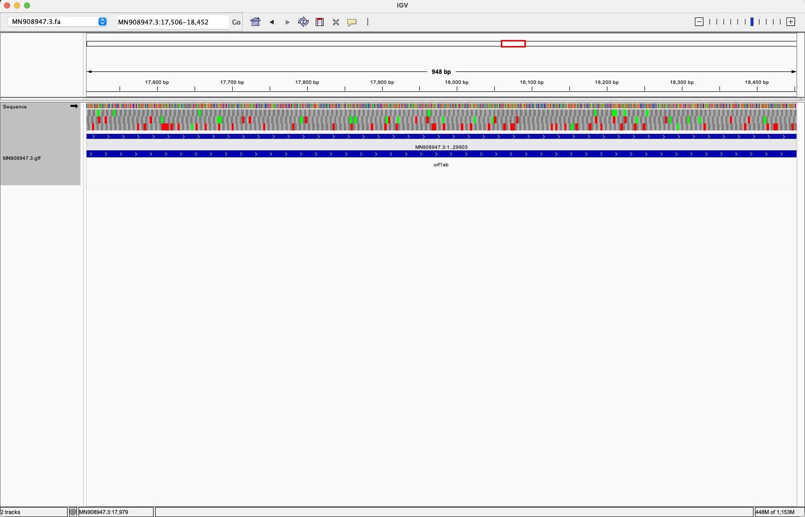
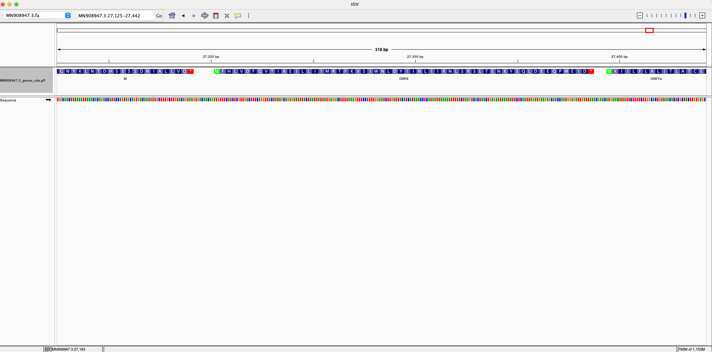
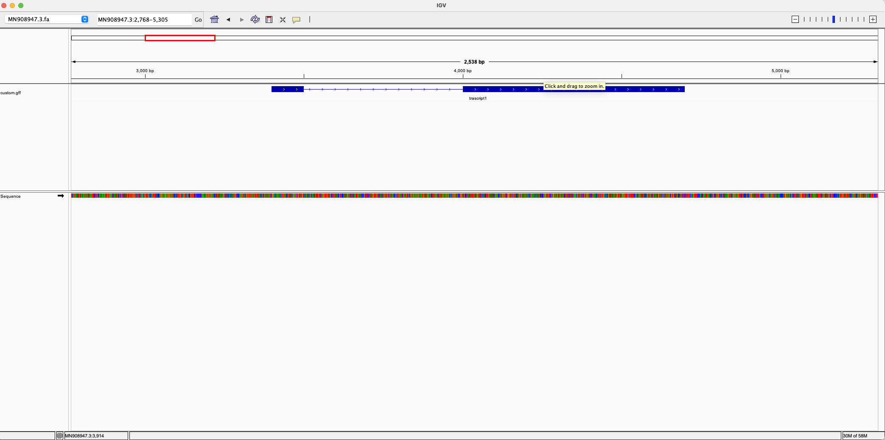

# Visualizing genomic data  - SARS-CoV-2

## 1. Prepare genome file
First, make a directory to store the genome file
Then, download and index the genome
```
# activate conda environment
conda activate bioinfo

# make directory for reference genome
mkdir ./ref_genome/ 

# download the genome
bio fetch  MN908947.3 -format fasta > ./ref_genome/MN908947.3.fa

# create an index of the FASTA file to load into IGV
samtools faidx ./ref_genome/MN908947.3.fa 

# download the GFF file for the same organism
bio fetch MN908947.3 -format gff >  ./ref_genome/MN908947.3.gff
```
## 2. Visualize genome in IGV
Load genome file into IGV
```
Open IGV -> Genomes -> Load genome from file -> Locate ./ref_genome/MN908947.3.fa
```

Load GFF file into IGV
```
IGV -> File -> Load from file -> Locate ./ref_genome/MN908947.3.gff
```

Here's a screenshot of my IGV after loading genome and gff file




## 3. Separate intervals of type "gene" into a different file

```
# filter the file to remove the beginning portion that starts with '#'
grep -v '^#' ./ref_genome/MN908947.3.gff > MN908947.3_filtered.gff

# select only 'gene' features

cat  MN908947.3_filtered.gff | grep 'gene' > MN908947.3_genes_cds.gff

```
Here's a screenshot of my IGV after the gene only gff file



As shown in the screenshot, ORF6 starts with a start condon (green M) and ends with a stop condon (red *)

## 4. Create GFF custom intervals
```
# make a new GFF file
touch custom.gff

# I added some gff features in the custom gff file following this:
MN908947.3	.	CDS	3400	3500	.	+	.	Parent=trascript1;ID=cds1
MN908947.3	.	CDS	4000	4700	.	+	.	Parent=trascript1;ID=cds2
```

Here's a screenshot of my custome gff file




